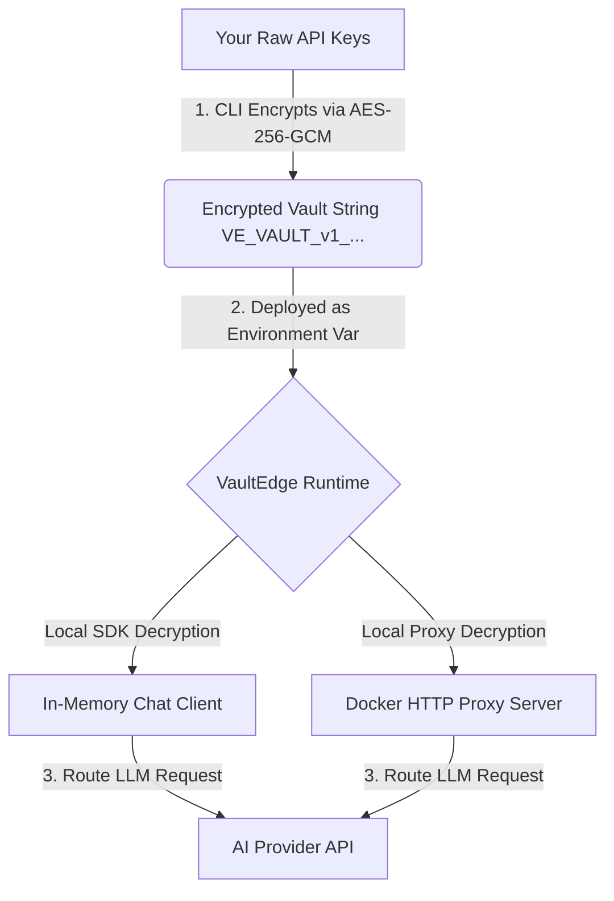

<div align="center">
  <h1>🔐 VaultEdge</h1>
  <p><strong>Zero-Trust AI Key Manager & Smart Proxy</strong></p>
  <p>Store LLM API keys encrypted. Route through 15+ providers. Fall back automatically. Never leak an API key again.</p>

  [](https://www.npmjs.com/package/@durgadas/vaultedge-cli)
  [](https://www.npmjs.com/package/vaultedge-sdk)
  [](https://pypi.org/project/vaultedge/)
  [](https://hub.docker.com/r/durgadas/vaultedge-proxy)
  [](LICENSE)
</div>

---

## 📖 What is VaultEdge?

VaultEdge is a **contributor-friendly, language-agnostic** AI API key manager and smart proxy. It is built to resolve three core problems in modern AI integrations:

1. **Local Development Security**: Never store raw API keys in `.env` files. Your credentials live locally on your machine in encrypted vaults.
2. **Zero-Trust Production Deployment**: Package your keys into a single portable, encrypted vault string. Keys are decrypted at the runtime edge (inside your SDK or local proxy) **in-memory only**. The server database never receives or stores your plaintext keys.
3. **Resilience & Smart Routing**: If a primary model provider (e.g. OpenAI) is down or rate-limited, the routing engine automatically and transparently falls back to secondary options (e.g. Gemini, Anthropic).

---

## 🛠️ How It Works: The Security Architecture

VaultEdge operates on a client-side encryption model utilizing standard Web Crypto APIs:



1. **Key Derivation (KDF)**: `PBKDF2-HMAC-SHA256` with **210,000 iterations** converts your Master Password into a cryptographically strong 256-bit encryption key.
2. **Encryption**: The vault payload is secured via **AES-256-GCM** (authenticated encryption) using a unique 12-byte initialization vector (nonce) and 32-byte salt per export.
3. **Cross-Platform Compatibility**: The wire format is fully standardized. A vault exported by the TypeScript CLI can be seamlessly decrypted by the TypeScript, Python, or Go SDKs, and the Docker Proxy.

---

## 🚀 Getting Started

### 1. Install the CLI
Install the command-line interface globally:
```bash
npm install -g @durgadas/vaultedge-cli
```

### 2. Initialize and Populate your Vault
Generate a local secure vault storage on your machine:
```bash
# Initialize local vault database
vaultedge vault init

# Add your API keys interactively (OpenAI, Gemini, Anthropic, etc.)
vaultedge vault add-key

# List configured keys
vaultedge vault list

# Export to a portable encrypted vault string
vaultedge vault export
# Generates -> VAULTEDGE_VAULT=VE_VAULT_v1_...
```

---

## 🖥️ Setup the Proxy Server

The standalone proxy server acts as an **OpenAI-compatible gateway**. You can point any standard OpenAI SDK at this proxy, and VaultEdge will handle decryption and routing transparently.

### Method A: Using Docker (Recommended)
Run the pre-built container from Docker Hub:
```bash
docker run -d \
  -p 8787:8787 \
  -e VAULTEDGE_VAULT="VE_VAULT_v1_your_vault_string" \
  -e VAULTEDGE_PASSWORD="your-master-password" \
  durgadas/vaultedge-proxy:latest
```

### Method B: Using Docker Compose
Create a `docker-compose.yml` file:
```yaml
version: '3.8'

services:
  vaultedge-proxy:
    image: durgadas/vaultedge-proxy:latest
    ports:
      - "8787:8787"
    environment:
      - VAULTEDGE_VAULT=VE_VAULT_v1_your_vault_string
      - VAULTEDGE_PASSWORD=your-master-password
```
Run with:
```bash
docker-compose up -d
```

### Method C: Running from Source
If you are developing locally or running directly with Node:
```bash
# 1. Install dependencies at root
npm install

# 2. Build monorepo packages
npm run build

# 3. Start the proxy server
VAULTEDGE_VAULT="VE_VAULT_v1_..." \
VAULTEDGE_PASSWORD="your-password" \
npm run dev:proxy
```

*The proxy server will print a **System Key** to the console on startup. Use this System Key as your bearer token when calling the proxy.*

---

## 🌐 Web Dashboard Setup

VaultEdge includes a Next.js-based web dashboard to manage your credentials in the browser using client-side Web Crypto.

To start the web dashboard locally:
```bash
# Start the local development server
npm run dev:web
```
Open [http://localhost:3000](http://localhost:3000) to access the dashboard. Credentials added here are saved fully encrypted in your browser's local storage.

---

## 🔌 SDK Integrations

### TypeScript / Node.js SDK
Install the SDK package:
```bash
npm install vaultedge-sdk
```
Usage:
```typescript
import { VaultEdge } from "vaultedge-sdk";

const ve = new VaultEdge({
  vault: process.env.VAULTEDGE_VAULT,
  password: process.env.VAULTEDGE_PASSWORD,
});

const response = await ve.chat.completions.create({
  model: "gpt-4o",
  messages: [{ role: "user", content: "Hello from TypeScript!" }],
});
console.log(response.choices[0].message.content);
```

### Python SDK
Install the PyPI package:
```bash
pip install vaultedge
```
Usage:
```python
import asyncio
import os
from vaultedge import VaultEdge

ve = VaultEdge(
    vault=os.environ["VAULTEDGE_VAULT"],
    password=os.environ["VAULTEDGE_PASSWORD"],
)

async def main():
    response = await ve.chat.completions.create(
        model="gemini-2.5-flash",
        messages=[{"role": "user", "content": "Hello from Python!"}],
    )
    print(response["choices"][0]["message"]["content"])

asyncio.run(main())
```

### Go SDK
Refer to [sdks/go/](sdks/go/) for Go integration details.

---

## ⚙️ Monorepo Structure

```text
vaultedge/
├── packages/
│   ├── core/        # Core cryptographic engine and router (shared)
│   ├── sdk/         # TypeScript Node.js SDK
│   └── cli/         # CLI tool source code
├── apps/
│   ├── proxy/       # Standalone HTTP proxy (OpenAI-compatible)
│   └── web/         # Next.js web dashboard
├── sdks/
│   ├── python/      # Python SDK
│   └── go/          # Go SDK
├── docker/          # Docker config files
└── providers.yaml   # Router config to add/map AI models
```

---

## 🛡️ License

MIT — see [LICENSE](./LICENSE).
